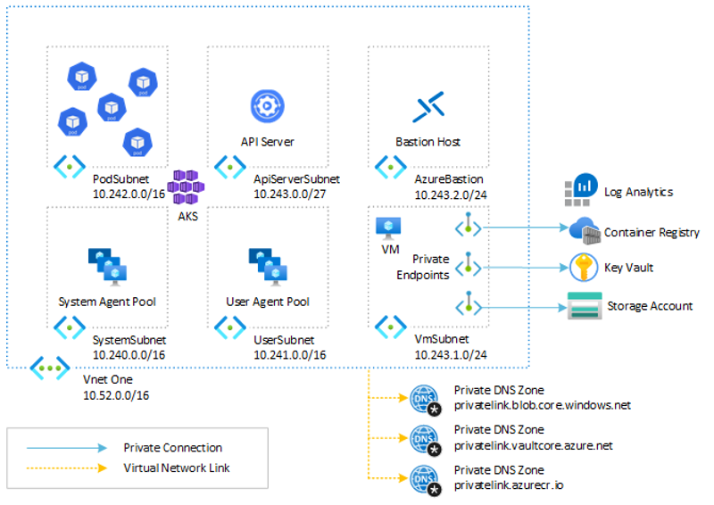

# Create an Azure Kubernetes Service (AKS) cluster with API Server VNET Integration using Bicep

This article plus sample shows how to deploy an [Azure Kubernetes Service](https://docs.microsoft.com/en-us/azure/aks/intro-kubernetes) (AKS) cluster with [API Server VNET Integration](https://learn.microsoft.com/en-us/azure/aks/api-server-vnet-integration). AKS clusters with API Server VNET integration provide a series of advantages, for example, they can have public network access or private cluster mode enabled or disabled without redeploying the cluster.

## Prerequisites

- An active [Azure subscription](https://docs.microsoft.com/en-us/azure/guides/developer/azure-developer-guide#understanding-accounts-subscriptions-and-billing). If you don't have one, create a [free Azure account](https://azure.microsoft.com/free/) before you begin.
- [Visual Studio Code](https://code.visualstudio.com/) installed on one of the [supported platforms](https://code.visualstudio.com/docs/supporting/requirements#_platforms) along with the [Bicep extension](https://marketplace.visualstudio.com/items?itemName=ms-azuretools.vscode-bicep).

## Architecture

This sample provides a Bicep and an ARM template to deploy a public or a private AKS cluster with [API Server VNET Integration](https://learn.microsoft.com/en-us/azure/aks/api-server-vnet-integration) with [Azure CNI](https://learn.microsoft.com/en-us/azure/aks/configure-azure-cni) network plugin and [Dynamic IP Allocation](https://learn.microsoft.com/en-us/azure/aks/configure-azure-cni#dynamic-allocation-of-ips-and-enhanced-subnet-support). In a production environment, we strongly recommend deploying a [private AKS cluster](https://docs.microsoft.com/en-us/azure/aks/private-clusters) with [Uptime SLA](https://docs.microsoft.com/en-us/azure/aks/uptime-sla). For more information, see [private AKS cluster with a Public DNS address](https://docs.microsoft.com/en-us/azure/aks/private-clusters#create-a-private-aks-cluster-with-a-public-dns-address). Alternatively, you can deploy a public AKS cluster and secure access to the API server using [authorized IP address ranges](https://learn.microsoft.com/en-us/azure/aks/api-server-authorized-ip-ranges). 



Both the Bicep and ARM template deploy the following Azure resources:

- [Microsoft.ContainerService/managedClusters](https://learn.microsoft.com/en-us/azure/templates/microsoft.containerservice/managedclusters?pivots=deployment-language-bicep): A public or private AKS cluster composed of a:
  - `system` node pool in a dedicated subnet. The default node pool hosts only critical system pods and services. The worker nodes have node taint which prevents application pods from beings scheduled on this node pool.
  - `user` node pool hosting user workloads and artifacts in a dedicated subnet.
- [Microsoft.Network/virtualNetworks](https://docs.microsoft.com/en-us/azure/templates/microsoft.network/virtualnetworks): a new virtual network with six subnets:
  - `SystemSubnet`: this subnet is used for the agent nodes of the `system` node pool.
  - `UserSubnet`: this subnet is used for the agent nodes of the `user` node pool.
  - `PodSubnet`: this subnet is used to allocate private IP addresses to pods dynamically.
  - `ApiServerSubnet`: API Server VNET Integration projects the API server endpoint directly into this delegated subnet in the virtual network where the AKS cluster is deployed.
  - `AzureBastionSubnet`: a subnet for the Azure Bastion Host.
  - `VmSubnet`: a subnet for a jump-box virtual machine used to connect to the (private) AKS cluster and for the private endpoints.
- [Microsoft.ManagedIdentity/userAssignedIdentities](https://learn.microsoft.com/en-us/azure/templates/microsoft.managedidentity/2018-11-30/userassignedidentities?pivots=deployment-language-bicep): a user-defined managed identity used by the AKS cluster to create additional resources like load balancers and managed disks in Azure.
- [Microsoft.Compute/virtualMachines](https://docs.microsoft.com/en-us/azure/templates/microsoft.compute/virtualmachines): Bicep modules create a jump-box virtual machine to manage the private AKS cluster.
- [Microsoft.Network/bastionHosts](https://docs.microsoft.com/en-us/azure/templates/microsoft.network/bastionhosts): a separate Azure Bastion is deployed in the AKS cluster virtual network to provide SSH connectivity to both agent nodes and virtual machines.
- [Microsoft.Storage/storageAccounts](https://docs.microsoft.com/en-us/azure/templates/microsoft.storage/storageaccounts): this storage account is used to store the boot diagnostics logs of both the service provider and service consumer virtual machines. Boot Diagnostics is a debugging feature that allows you to view console output and screenshots to diagnose virtual machine status.
- [Microsoft.ContainerRegistry/registries](https://learn.microsoft.com/en-us/azure/templates/microsoft.containerregistry/registries?pivots=deployment-language-bicep): an Azure Container Registry (ACR) to build, store, and manage container images and artifacts in a private registry for all container deployments.
- [Microsoft.KeyVault/vaults](https://learn.microsoft.com/en-us/azure/templates/microsoft.keyvault/vaults?pivots=deployment-language-bicep): an Azure Key Vault used to store secrets, certificates, and keys that can be mounted as files by pods using [Azure Key Vault Provider for Secrets Store CSI Driver](https://github.com/Azure/secrets-store-csi-driver-provider-azure). For more information, see [Use the Azure Key Vault Provider for Secrets Store CSI Driver in an AKS cluster](https://learn.microsoft.com/en-us/azure/aks/csi-secrets-store-driver) and [Provide an identity to access the Azure Key Vault Provider for Secrets Store CSI Driver](https://learn.microsoft.com/en-us/azure/aks/csi-secrets-store-identity-access).
- [Microsoft.Network/privateEndpoints](https://docs.microsoft.com/en-us/azure/templates/microsoft.network/privateendpoints): an [Azure Private Endpoints](https://docs.microsoft.com/en-us/azure/private-link/private-endpoint-overview) is created for each of the following resources:
  - Azure Container Registry
  - Azure Key Vault
  - Azure Storage Account
  - API Server when deploying a private AKS cluster.
- [Microsoft.Network/privateDnsZones](https://docs.microsoft.com/en-us/azure/templates/microsoft.network/privatednszones): an [Azure Private DNS Zone](https://docs.microsoft.com/en-us/azure/dns/private-dns-overview) is created for each of the following resources:
  - Azure Container Registry
  - Azure Key Vault
  - Azure Storage Account
  - API Server when deploying a private AKS cluster.
- [Microsoft.Network/networkSecurityGroups](https://docs.microsoft.com/en-us/azure/templates/microsoft.network/networksecuritygroups?tabs=bicep): subnets hosting virtual machines and Azure Bastion Hosts are protected by [Azure Network Security Groups](https://docs.microsoft.com/en-us/azure/virtual-network/network-security-groups-overview) that are used to filter inbound and outbound traffic.
- [Microsoft.OperationalInsights/workspaces](https://docs.microsoft.com/en-us/azure/templates/microsoft.operationalinsights/workspaces): a centralized [Azure Log Analytics](https://docs.microsoft.com/en-us/azure/azure-monitor/logs/log-analytics-workspace-overview) workspace is used to collect the diagnostics logs and metrics from all the Azure resources:
  - Azure Kubernetes Service cluster
  - Azure Key Vault
  - Azure Network Security Group
  - Azure Container Registry
  - Azure Storage Account
- [Microsoft.Resources/deploymentScripts](https://learn.microsoft.com/en-us/azure/templates/microsoft.resources/deploymentscripts?pivots=deployment-language-bicep): a deployment script is used to run the `install-helm-charts.sh` Bash script which installs the following packages to the AKS cluster via [Helm](https://helm.sh/). For more information on deployment scripts, see [Use deployment scripts in Bicep](https://learn.microsoft.com/en-us/azure/azure-resource-manager/bicep/deployment-script-bicep)
  - [NGINX Ingress Controller](https://docs.nginx.com/nginx-ingress-controller/)
  - [Cert-Manager](https://cert-manager.io/docs/)
  - [Prometheus](https://prometheus.io/)

> **NOTE**  
> You can find the `architecture.vsdx` file used for the diagram under the `visio` folder.

## What is Bicep?

[Bicep](https://docs.microsoft.com/en-us/azure/azure-resource-manager/bicep/overview) is a domain-specific language (DSL) that uses a declarative syntax to deploy Azure resources. It provides concise syntax, reliable type safety, and support for code reuse. Bicep offers the best authoring experience for your infrastructure-as-code solutions in Azure.

## API Server VNET Integration

An Azure Kubernetes Service (AKS) cluster configured with API Server VNET Integration projects the API server endpoint directly into a delegated subnet in the virtual network where the AKS cluster is deployed. This enables network communication between the API server and the cluster nodes without requiring a private link or tunnel. The API server will be available behind a Standard Internal Load Balancer VIP in the delegated subnet, which the agent nodes will be configured to utilize. The Internal Load Balancer is called `kube-apiserver` and is created in the [node resource group](https://learn.microsoft.com/en-us/azure/aks/faq#why-are-two-resource-groups-created-with-aks), which contains all of the infrastructure resources associated with the cluster.


By using API Server VNET Integration, you can guarantee that the network traffic between your API server and your node pools remains in the virtual network. The control plane or API server is in an Azure Kubernetes Service (AKS)-managed Azure subscription. Your AKS cluster and node pools are instead in your Azure subscription. The agent nodes of your cluster can communicate with the API server through the API server VIP and pod IPs projected into the delegated subnet. The following figure shows the `kube-apiserver-frontend` frontend IP configuration of the `kube-apiserver` Internal Load Balancer used by agent nodes to invoke the API server in a cluster with API Server VNET Integration.


The `kube-apiserver` Internal Load Balancer has a backend pool called `kube-apiserver-backendpool` which contains the private IP address of the API Server pods projected in the delegated subnet.


API Server VNET Integration is supported for public or private clusters, and public access can be added or removed after cluster provisioning. Unlike non-VNET integrated clusters, the agent nodes always communicate directly with the private IP address of the API Server Internal Load Balancer (ILB) IP without using DNS. If you open an SSH session to any of the AKS cluster agent nodes via Azure Bastion Host and you run the `sudo cat /var/lib/kubelet/kubeconfig` command to see the [kubeconfig](https://kubernetes.io/docs/tasks/access-application-cluster/configure-access-multiple-clusters/) file, you will notice that the cluster server contains the private IP address of the `kube-apiserver` load balancer in place of the FQDN of the API Server as in a non-VNet integrated cluster.


*kubeconfig of an AKS cluster with API Server VNET Integration*


*kubeconfig of an AKS cluster without API Server VNET Integration*

All node to API server traffic is kept on private networking and no tunnel is required for API server to node connectivity. Out-of-cluster clients needing to communicate with the API server can do so normally if public network access is enabled. If the AKS cluster is public and you are allowed to access the API Server from your machine, you can run the `az aks show -n <cluster-name> -g <cluster-resource-group> --query fqdn -o tsv | nslookup -` command to run `nslookup` against the FQDN of the API server, as shown in the following figure:


If you need to access the API server from a virtual machine located in the same virtual network of the AKS cluster, for example via [kubectl](https://kubernetes.io/docs/tasks/tools/), you can use the private IP address of the `kube-apiserver-frontend` frontend IP configuration of the `kube-apiserver` Internal Load Balancer to keep the traffic within the virtual network. Instead, if you use the API Server FQDN, the virtual machine will communicate with the API Server via a public IP.
If public network access is disabled, any virtual machine in the cluster virtual network, or any peered virtual network, should follow the same private DNS setup methodology of a standard [private AKS cluster](https://learn.microsoft.com/en-us/azure/aks/private-clusters). For more information, see [Create a private AKS cluster with API Server VNET Integration using bring-your-own VNET](https://learn.microsoft.com/en-us/azure/aks/api-server-vnet-integration#create-an-aks-private-cluster-with-api-server-vnet-integration-using-bring-your-own-vnet).

When using Bicep to deploy an AKS cluster with API server with VNET integration, you need to proceed as follows:

- Create a dedicated subnet for the API Server. This subnet will be delegated to the `Microsoft.ContainerService/managedClusters` resource type and should not contain other Azure resources. Please note the `apiServerSubnetName` subnet in the Bicep snippet below.

```bicep
resource vnet 'Microsoft.Network/virtualNetworks@2021-08-01' = {
  name: virtualNetworkName
  location: location
  tags: tags
  properties: {
    addressSpace: {
      addressPrefixes: [
        virtualNetworkAddressPrefixes
      ]
    }
    subnets: [
      {
        name: systemAgentPoolSubnetName
        properties: {
          addressPrefix: systemAgentPoolSubnetAddressPrefix
          privateEndpointNetworkPolicies: 'Disabled'
          privateLinkServiceNetworkPolicies: 'Enabled'
        }
      }
      {
        name: userAgentPoolSubnetName
        properties: {
          addressPrefix: userAgentPoolSubnetAddressPrefix
          privateEndpointNetworkPolicies: 'Disabled'
          privateLinkServiceNetworkPolicies: 'Enabled'
        }
      }
      {
        name: podSubnetName
        properties: {
          addressPrefix: podSubnetAddressPrefix
          privateEndpointNetworkPolicies: 'Disabled'
          privateLinkServiceNetworkPolicies: 'Enabled'
        }
      }
      {
        name: apiServerSubnetName
        properties: {
          addressPrefix: apiServerSubnetAddressPrefix
          privateEndpointNetworkPolicies: 'Disabled'
          privateLinkServiceNetworkPolicies: 'Enabled'
        }
      }
      {
        name: vmSubnetName
        properties: {
          addressPrefix: vmSubnetAddressPrefix
          networkSecurityGroup: {
            id: vmSubnetNsg.id
          }
          privateEndpointNetworkPolicies: 'Disabled'
          privateLinkServiceNetworkPolicies: 'Enabled'
        }
      }
      {
        name: bastionSubnetName
        properties: {
          addressPrefix: bastionSubnetAddressPrefix
          networkSecurityGroup: {
            id: bastionSubnetNsg.id
          }
        }
      }
    ]
  }
}
```

- Set the [enableVnetIntegration](https://learn.microsoft.com/en-us/azure/templates/microsoft.containerservice/managedclusters?pivots=deployment-language-bicep#managedclusterapiserveraccessprofile) property to `true` to enable API Server VNET Integration.
- Set the [subnetId](https://learn.microsoft.com/en-us/azure/templates/microsoft.containerservice/managedclusters?pivots=deployment-language-bicep#managedclusterapiserveraccessprofile) to the resource id of the delegated subnet where the API Server VIP and Pod IPs will be projected.

```bicep
resource apiServerSubnet 'Microsoft.Network/virtualNetworks/subnets@2021-08-01' existing = {
  parent: virtualNetwork
  name: apiServerSubnetName
}

...

resource aksCluster 'Microsoft.ContainerService/managedClusters@2022-05-02-preview' = {
  name: name
  location: location
  tags: tags
  sku: {
    name: 'Basic'
    tier: skuTier
  }
  identity: {
    type: 'UserAssigned'
    userAssignedIdentities: {
      '${managedIdentity.id}': {}
    }
  }
  properties: {
  ...
    apiServerAccessProfile: {
      enablePrivateCluster: enablePrivateCluster
      enableVnetIntegration: enableVnetIntegration
      privateDNSZone: enablePrivateCluster ? privateDNSZone : json('null')
      enablePrivateClusterPublicFQDN: enablePrivateClusterPublicFQDN
      subnetId: apiServerSubnet.id
    }
  }  
}
```

## Convert an existing AKS cluster to API Server VNET Integration

Existing AKS public clusters can be converted to API Server VNET Integration clusters by supplying an API server subnet that meets the following requirements: 

- The supplied subnet needs to be in the same virtual network as the cluster nodes
- Network contributor permissions need to be granted for the AKS cluster identity
- Subnet CIDR size needs to be at least /28
- The subnet should not contain other Azure resources.

This is a one-way migration; clusters cannot have API Server VNET Integration disabled after enabling it. This upgrade will perform a node-image version upgrade on all agent nodes. All the workloads will be restarted as all nodes undergo a rolling image upgrade.

> [!WARNING]
> Converting a cluster to API Server VNET Integration will result in a change of the API Server IP address, though the hostname will remain the same. If the IP address of the API server has been configured in any firewalls or network security group rules, those rules may need to be updated.

```bash
az aks update -n <cluster-name> \
    -g <resource-group> \
    --enable-apiserver-vnet-integration \
    --apiserver-subnet-id <apiserver-subnet-resource-id>
```

## Enable or disable private cluster mode on an existing cluster with API Server VNET Integration

AKS clusters configured with API Server VNET Integration can have public network access/private cluster mode enabled or disabled without redeploying the cluster. The API server hostname will not change, but public DNS entries will be modified or removed as appropriate.

### Enable private cluster mode

```bash
az aks update -n <cluster-name> \
    -g <resource-group> \
    --enable-private-cluster
```

### Disable private cluster mode

```bash
az aks update -n <cluster-name> \
    -g <resource-group> \
    --disable-private-cluster
```

## Limitations

- Existing AKS private clusters cannot be converted to API Server VNET Integration clusters at this time.
- [Private Link Service](https://learn.microsoft.com/en-us/azure/private-link/private-link-service-overview#limitations) will not work if deployed against the API Server injected addresses at this time, so the API server cannot be exposed to other virtual networks via private link. To access the API server from outside the cluster network, utilize either [VNet peering](https://learn.microsoft.com/en-us/azure/virtual-network/virtual-network-peering-overview) or [AKS run command](https://learn.microsoft.com/en-us/azure/aks/command-invoke).

## Deploy the Bicep modules

You can deploy the Bicep modules in the `bicep` folder using the `deploy.sh` Bash script in the same folder. Specify a value for the following parameters in the `deploy.sh` script and `main.parameters.json` parameters file before deploying the Bicep modules.

- `prefix`: specifies a prefix for the AKS cluster and other Azure resources.
- `authenticationType`: specifies the type of authentication when accessing the Virtual Machine. `sshPublicKey` is the recommended value. Allowed values: `sshPublicKey` and `password`.
- `vmAdminUsername`: specifies the name of the administrator account of the virtual machine.
- `vmAdminPasswordOrKey`: specifies the SSH Key or password for the virtual machine.
- `aksClusterSshPublicKey`:  specifies the SSH Key or password for AKS cluster agent nodes.
- `aadProfileAdminGroupObjectIDs`: when deploying an AKS cluster with Azure AD and Azure RBAC integration, this array parameter contains the list of Azure AD group object IDs that will have the admin role of the cluster.
- `keyVaultObjectIds`: Specifies the object ID of the service principals to configure in Key Vault access policies.

We suggest reading sensitive configuration data such as passwords or SSH keys from a pre-existing Azure Key Vault resource. For more information, see [Use Azure Key Vault to pass secure parameter value during Bicep deployment](https://docs.microsoft.com/en-us/azure/azure-resource-manager/bicep/key-vault-parameter?tabs=azure-cli).

```bash
#!/bin/bash

# Template
template="main.bicep"
parameters="main.parameters.json"

# AKS cluster name
aksPrefix="<cluster-name-prefix>"
aksName="${aksPrefix}Aks"
validateTemplate=1
useWhatIf=1
installExtensions=0

# Name and location of the resource group for the Azure Kubernetes Service (AKS) cluster
aksResourceGroupName="${aksPrefix}RG"
location="eastus2"

# Name and resource group name of the Azure Container Registry used by the AKS cluster.
# The name of the cluster is also used to create or select an existing admin group in the Azure AD tenant.
acrName="${aksPrefix}Acr"
acrResourceGroupName="$aksResourceGroupName"
acrSku="Premium"

# Name of Key Vault
keyVaultName="${aksPrefix}KeyVault"

# Name of the virtual machine
vmName="${aksPrefix}Vm"

# Subscription id, subscription name, and tenant id of the current subscription
subscriptionId=$(az account show --query id --output tsv)
subscriptionName=$(az account show --query name --output tsv)
tenantId=$(az account show --query tenantId --output tsv)

# Install aks-preview Azure extension
if [[ $installExtensions == 1 ]]; then
  echo "Checking if [aks-preview] extension is already installed..."
  az extension show --name aks-preview &>/dev/null

  if [[ $? == 0 ]]; then
    echo "[aks-preview] extension is already installed"

    # Update the extension to make sure you have the latest version installed
    echo "Updating [aks-preview] extension..."
    az extension update --name aks-preview &>/dev/null
  else
    echo "[aks-preview] extension is not installed. Installing..."

    # Install aks-preview extension
    az extension add --name aks-preview 1>/dev/null

    if [[ $? == 0 ]]; then
      echo "[aks-preview] extension successfully installed"
    else
      echo "Failed to install [aks-preview] extension"
      exit
    fi
  fi

  # Registering AKS feature extensions
  aksExtensions=("PodSecurityPolicyPreview" "KubeletDisk" "AKS-KedaPreview" "RunCommandPreview" "EnablePodIdentityPreview " "UserAssignedIdentityPreview" "EnablePrivateClusterPublicFQDN" "PodSubnetPreview" "EnableOIDCIssuerPreview")
  ok=0
  registeringExtensions=()
  for aksExtension in ${aksExtensions[@]}; do
    echo "Checking if [$aksExtension] extension is already registered..."
    extension=$(az feature list -o table --query "[?contains(name, 'Microsoft.ContainerService/$aksExtension') && @.properties.state == 'Registered'].{Name:name}" --output tsv)
    if [[ -z $extension ]]; then
      echo "[$aksExtension] extension is not registered."
      echo "Registering [$aksExtension] extension..."
      az feature register --name $aksExtension --namespace Microsoft.ContainerService
      registeringExtensions+=("$aksExtension")
      ok=1
    else
      echo "[$aksExtension] extension is already registered."
    fi
  done
  echo $registeringExtensions
  delay=1
  for aksExtension in ${registeringExtensions[@]}; do
    echo -n "Checking if [$aksExtension] extension is already registered..."
    while true; do
      extension=$(az feature list -o table --query "[?contains(name, 'Microsoft.ContainerService/$aksExtension') && @.properties.state == 'Registered'].{Name:name}" --output tsv)
      if [[ -z $extension ]]; then
        echo -n "."
        sleep $delay
      else
        echo "."
        break
      fi
    done
  done

  if [[ $ok == 1 ]]; then
    echo "Refreshing the registration of the Microsoft.ContainerService resource provider..."
    az provider register --namespace Microsoft.ContainerService
    echo "Microsoft.ContainerService resource provider registration successfully refreshed"
  fi
fi

# Get the last Kubernetes version available in the region
kubernetesVersion=$(az aks get-versions --location $location --query "orchestrators[?isPreview==false].orchestratorVersion | sort(@) | [-1]" --output tsv)

if [[ -n $kubernetesVersion ]]; then
  echo "Successfully retrieved the last Kubernetes version [$kubernetesVersion] supported by AKS in [$location] Azure region"
else
  echo "Failed to retrieve the last Kubernetes version supported by AKS in [$location] Azure region"
  exit
fi

# Check if the resource group already exists
echo "Checking if [$aksResourceGroupName] resource group actually exists in the [$subscriptionName] subscription..."

az group show --name $aksResourceGroupName &>/dev/null

if [[ $? != 0 ]]; then
  echo "No [$aksResourceGroupName] resource group actually exists in the [$subscriptionName] subscription"
  echo "Creating [$aksResourceGroupName] resource group in the [$subscriptionName] subscription..."

  # Create the resource group
  az group create --name $aksResourceGroupName --location $location 1>/dev/null

  if [[ $? == 0 ]]; then
    echo "[$aksResourceGroupName] resource group successfully created in the [$subscriptionName] subscription"
  else
    echo "Failed to create [$aksResourceGroupName] resource group in the [$subscriptionName] subscription"
    exit
  fi
else
  echo "[$aksResourceGroupName] resource group already exists in the [$subscriptionName] subscription"
fi

# Create AKS cluster if does not exist
echo "Checking if [$aksName] aks cluster actually exists in the [$aksResourceGroupName] resource group..."

az aks show --name $aksName --resource-group $aksResourceGroupName &>/dev/null

if [[ $? != 0 ]]; then
  echo "No [$aksName] aks cluster actually exists in the [$aksResourceGroupName] resource group"

  # Delete any existing role assignments for the user-defined managed identity of the AKS cluster
  # in case you are re-deploying the solution in an existing resource group
  echo "Retrieving the list of role assignments on [$aksResourceGroupName] resource group..."
  assignmentIds=$(az role assignment list \
    --scope "/subscriptions/${subscriptionId}/resourceGroups/${aksResourceGroupName}" \
    --query [].id \
    --output tsv \
    --only-show-errors)

  if [[ -n $assignmentIds ]]; then
    echo "[${#assignmentIds[@]}] role assignments have been found on [$aksResourceGroupName] resource group"
    for assignmentId in ${assignmentIds[@]}; do
      if [[ -n $assignmentId ]]; then
        az role assignment delete --ids $assignmentId

        if [[ $? == 0 ]]; then
          assignmentName=$(echo $assignmentId | awk -F '/' '{print $NF}')
          echo "[$assignmentName] role assignment on [$aksResourceGroupName] resource group successfully deleted"
        fi
      fi
    done
  else
    echo "No role assignment actually exists on [$aksResourceGroupName] resource group"
  fi

  # Get the kubelet managed identity used by the AKS cluster
  echo "Retrieving the kubelet identity from the [$aksName] AKS cluster..."
  clientId=$(az aks show \
    --name $aksName \
    --resource-group $aksResourceGroupName \
    --query identityProfile.kubeletidentity.clientId \
    --output tsv 2>/dev/null)

  if [[ -n $clientId ]]; then
    # Delete any role assignment to kubelet managed identity on any ACR in the resource group
    echo "kubelet identity of the [$aksName] AKS cluster successfully retrieved"
    echo "Retrieving the list of ACR resources in the [$aksResourceGroupName] resource group..."
    acrIds=$(az acr list \
      --resource-group $aksResourceGroupName \
      --query [].id \
      --output tsv)

    if [[ -n $acrIds ]]; then
      echo "[${#acrIds[@]}] ACR resources have been found in [$aksResourceGroupName] resource group"
      for acrId in ${acrIds[@]}; do
        if [[ -n $acrId ]]; then
          acrName=$(echo $acrId | awk -F '/' '{print $NF}')
          echo "Retrieving the list of role assignments on [$acrName] ACR..."
          assignmentIds=$(az role assignment list \
            --scope "$acrId" \
            --query [].id \
            --output tsv \
            --only-show-errors)

          if [[ -n $assignmentIds ]]; then
            echo "[${#assignmentIds[@]}] role assignments have been found on [$acrName] ACR"
            for assignmentId in ${assignmentIds[@]}; do
              if [[ -n $assignmentId ]]; then
                az role assignment delete --ids $assignmentId

                if [[ $? == 0 ]]; then
                  assignmentName=$(echo $assignmentId | awk -F '/' '{print $NF}')
                  echo "[$assignmentName] role assignment on [$acrName] ACR successfully deleted"
                fi
              fi
            done
          else
            echo "No role assignment actually exists on [$acrName] ACR"
          fi
        fi
      done
    else
      echo "No ACR actually exists in [$aksResourceGroupName] resource group"
    fi
  else
    echo "No kubelet identity exists for the [$aksName] AKS cluster"
  fi

  # Validate the Bicep template
  if [[ $validateTemplate == 1 ]]; then
    if [[ $useWhatIf == 1 ]]; then
      # Execute a deployment What-If operation at resource group scope.
      echo "Previewing changes deployed by [$template] Bicep template..."
      az deployment group what-if \
        --resource-group $aksResourceGroupName \
        --template-file $template \
        --parameters $parameters \
        --parameters aksClusterName=$aksName \
        aksClusterKubernetesVersion=$kubernetesVersion \
        acrName=$acrName \
        keyVaultName=$keyVaultName \
        vmName=$vmName

      if [[ $? == 0 ]]; then
        echo "[$template] Bicep template validation succeeded"
      else
        echo "Failed to validate [$template] Bicep template"
        exit
      fi
    else
      # Validate the Bicep template
      echo "Validating [$template] Bicep template..."
      output=$(az deployment group validate \
        --resource-group $aksResourceGroupName \
        --template-file $template \
        --parameters $parameters \
        --parameters aksClusterName=$aksName \
        aksClusterKubernetesVersion=$kubernetesVersion \
        acrName=$acrName \
        keyVaultName=$keyVaultName \
        vmName=$vmName)

      if [[ $? == 0 ]]; then
        echo "[$template] Bicep template validation succeeded"
      else
        echo "Failed to validate [$template] Bicep template"
        echo $output
        exit
      fi
    fi
  fi

  # Deploy the Bicep template
  echo "Deploying [$template] Bicep template..."
  az deployment group create \
    --resource-group $aksResourceGroupName \
    --only-show-errors \
    --template-file $template \
    --parameters $parameters \
    --parameters aksClusterName=$aksName \
    aksClusterKubernetesVersion=$kubernetesVersion \
    acrName=$acrName \
    keyVaultName=$keyVaultName \
    vmName=$vmName 1>/dev/null

  if [[ $? == 0 ]]; then
    echo "[$template] Bicep template successfully provisioned"
  else
    echo "Failed to provision the [$template] Bicep template"
    exit
  fi
else
  echo "[$aksName] aks cluster already exists in the [$aksResourceGroupName] resource group"
fi

# Create AKS cluster if does not exist
echo "Checking if [$aksName] aks cluster actually exists in the [$aksResourceGroupName] resource group..."

az aks show --name $aksName --resource-group $aksResourceGroupName &>/dev/null

if [[ $? != 0 ]]; then
  echo "No [$aksName] aks cluster actually exists in the [$aksResourceGroupName] resource group"
  exit
fi

# Get the user principal name of the current user
echo "Retrieving the user principal name of the current user from the [$tenantId] Azure AD tenant..."
userPrincipalName=$(az account show --query user.name --output tsv)
if [[ -n $userPrincipalName ]]; then
  echo "[$userPrincipalName] user principal name successfully retrieved from the [$tenantId] Azure AD tenant"
else
  echo "Failed to retrieve the user principal name of the current user from the [$tenantId] Azure AD tenant"
  exit
fi

# Retrieve the objectId of the user in the Azure AD tenant used by AKS for user authentication
echo "Retrieving the objectId of the [$userPrincipalName] user principal name from the [$tenantId] Azure AD tenant..."
userObjectId=$(az ad user show --id $userPrincipalName --query id --output tsv 2>/dev/null)

if [[ -n $userObjectId ]]; then
  echo "[$userObjectId] objectId successfully retrieved for the [$userPrincipalName] user principal name"
else
  echo "Failed to retrieve the objectId of the [$userPrincipalName] user principal name"
  exit
fi

# Retrieve the resource id of the AKS cluster
echo "Retrieving the resource id of the [$aksName] AKS cluster..."
aksClusterId=$(az aks show \
  --name "$aksName" \
  --resource-group "$aksResourceGroupName" \
  --query id \
  --output tsv 2>/dev/null)

if [[ -n $aksClusterId ]]; then
  echo "Resource id of the [$aksName] AKS cluster successfully retrieved"
else
  echo "Failed to retrieve the resource id of the [$aksName] AKS cluster"
  exit
fi

# Assign Azure Kubernetes Service RBAC Cluster Admin role to the current user
role="Azure Kubernetes Service RBAC Cluster Admin"
echo "Checking if [$userPrincipalName] user has been assigned to [$role] role on the [$aksName] AKS cluster..."
current=$(az role assignment list \
  --assignee $userObjectId \
  --scope $aksClusterId \
  --query "[?roleDefinitionName=='$role'].roleDefinitionName" \
  --output tsv 2>/dev/null)

if [[ $current == "Owner" ]] || [[ $current == "Contributor" ]] || [[ $current == "$role" ]]; then
  echo "[$userPrincipalName] user is already assigned to the [$current] role on the [$aksName] AKS cluster"
else
  echo "[$userPrincipalName] user is not assigned to the [$role] role on the [$aksName] AKS cluster"
  echo "Assigning the [$userPrincipalName] user to the [$role] role on the [$aksName] AKS cluster..."

  az role assignment create \
    --role "$role" \
    --assignee $userObjectId \
    --scope $aksClusterId \
    --only-show-errors 1>/dev/null

  if [[ $? == 0 ]]; then
    echo "[$userPrincipalName] user successfully assigned to the [$role] role on the [$aksName] AKS cluster"
  else
    echo "Failed to assign the [$userPrincipalName] user to the [$role] role on the [$aksName] AKS cluster"
    exit
  fi
fi

# Assign Azure Kubernetes Service Cluster Admin Role role to the current user
role="Azure Kubernetes Service Cluster Admin Role"
echo "Checking if [$userPrincipalName] user has been assigned to [$role] role on the [$aksName] AKS cluster..."
current=$(az role assignment list \
  --assignee $userObjectId \
  --scope $aksClusterId \
  --query "[?roleDefinitionName=='$role'].roleDefinitionName" \
  --output tsv 2>/dev/null)

if [[ $current == "Owner" ]] || [[ $current == "Contributor" ]] || [[ $current == "$role" ]]; then
  echo "[$userPrincipalName] user is already assigned to the [$current] role on the [$aksName] AKS cluster"
else
  echo "[$userPrincipalName] user is not assigned to the [$role] role on the [$aksName] AKS cluster"
  echo "Assigning the [$userPrincipalName] user to the [$role] role on the [$aksName] AKS cluster..."

  az role assignment create \
    --role "$role" \
    --assignee $userObjectId \
    --scope $aksClusterId \
    --only-show-errors 1>/dev/null

  if [[ $? == 0 ]]; then
    echo "[$userPrincipalName] user successfully assigned to the [$role] role on the [$aksName] AKS cluster"
  else
    echo "Failed to assign the [$userPrincipalName] user to the [$role] role on the [$aksName] AKS cluster"
    exit
  fi
fi
```

## Review deployed resources

Use the Azure portal, Azure CLI, or Azure PowerShell to list the deployed resources in the resource group.

### Azure CLI

```azurecli
az resource list --resource-group <resource-group-name>
```

### PowerShell

```azurepowershell
Get-AzResource -ResourceGroupName <resource-group-name>
```

### Azure Portal


*Figure: Azure Resources in the resource group.*


*Figure: Azure Resources in the node resource group.*


*Figure: Subnets in the BYO virtual network.*

## Clean up resources

When you no longer need the resources you created, just delete the resource group. This will remove all the Azure resources.

## Next Steps

For more information, see [Create an Azure Kubernetes Service cluster with API Server VNET Integration](https://learn.microsoft.com/en-us/azure/aks/api-server-vnet-integration)